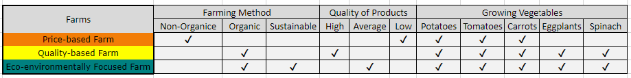
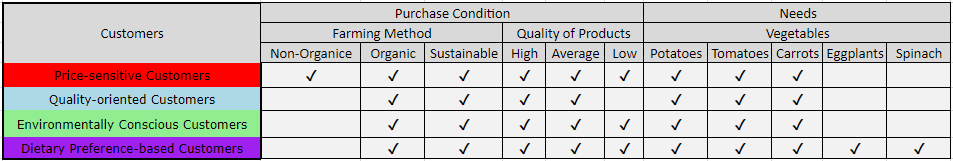
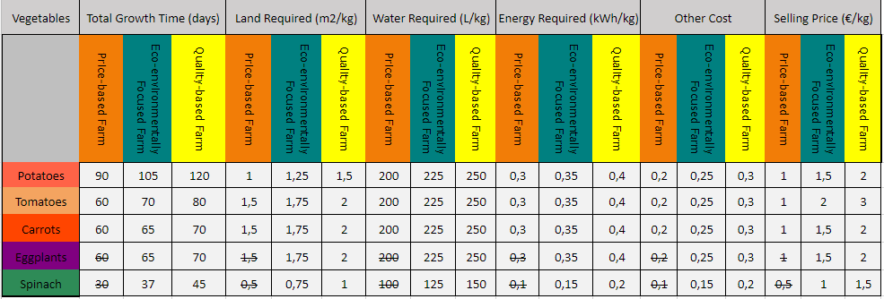

<h1>Agent-Based Modeling for Strategic Management of Urban Food-Energy-Water Nexus for Sustainable Development</h1>

<h2>Overview</h2>

This agent-based model, created from scratch using the Mesa package, simulates the strategic management of urban farms within the context of the Food-Energy-Water (FEW) Nexus. Drawing inspiration from the principles of strategic management, including the influential work of Michael Porter, the model explores the dynamics and outcomes of different strategies implemented by urban farms.

By considering the interplay between ecological sustainability, resource management, and economic viability, this model offers insights into the complex relationships within the FEW Nexus. It allows users to simulate and analyze various strategic approaches, such as cost leadership, differentiation, or niche market targeting, to optimize the performance and resilience of urban farms.

The model is designed to aid decision-making and policy formulation in the pursuit of sustainable development goals. It enables users to evaluate the impact of different strategic management approaches on farm profitability, resource utilization, customer satisfaction, and overall system dynamics. The model's implementation using the <a href="https://github.com/projectmesa">Mesa</a> package ensures flexibility, scalability, and ease of customization for specific urban farm contexts.

This agent-based model simulates the interactions between three types of urban farms - Price-Based, Quality-Based, and Eco-Environmentally Focused - and four types of customers - Price-Sensitive, Quality-Oriented, Environmentally Conscious, and Dietary Preference-Based. Each type of farm pursues a different competitive strategy based on the Porter's generic strategies framework.

<h2>Price-Based Farm Strategy</h2>

The Price-Based farm focuses on producing high-demand vegetables at a competitive price to attract cost-conscious customers. It implements cost-saving measures such as using efficient irrigation systems, minimizing waste, and optimizing production processes to reduce production costs. This approach aligns with the cost leadership strategy of Michael Porter, which emphasizes minimizing costs to achieve a competitive advantage through price leadership.

<h2>Quality-Based Farm Strategy</h2>

The Quality-Based farm focuses on producing high-quality, fresh vegetables from local farms to attract customers who are willing to pay a premium for superior quality. It invests in premium inputs and practices, such as organic fertilizers, high-quality seeds, and advanced irrigation systems, to produce the highest quality vegetables possible. This approach aligns with the differentiation strategy of Michael Porter, which emphasizes differentiating its products to achieve a competitive advantage through customer appeal.

<h2>Eco-Environmentally Focused Farm Strategy</h2>

The Eco-Environmentally Focused farm prioritizes sustainability by producing vegetables with a low water footprint and those produced using renewable energy to attract environmentally conscious customers. It invests in renewable energy sources such as solar panels to generate electricity, and it implements a rainwater collection system to minimize its reliance on municipal water and have a more green water footprint. This approach aligns with the focused differentiation strategy of Michael Porter, which emphasizes focusing on a narrow market segment to achieve a competitive advantage through product differentiation.

The Blue Ocean Strategy is a business strategy that identifies and exploits an uncontested market space, thereby creating new demand and differentiating the company from its rivals. The Eco-Environmentally Focused farm could be considered to be pursuing a Blue Ocean Strategy because it is targeting a segment of the market that is currently underserved - environmentally conscious customers who are willing to pay a premium for sustainable vegetables. This could allow the farm to achieve a sustainable competitive advantage.

The Eco-Environmentally Focused Farm sources its data for renewable energy generation from the NSRDB data for Genova in 2019. This data provides information on the solar irradiance in Genova, which is used to calculate the amount of electricity generated by the farm's solar panels. The farm also uses data from VisualCrossing rainfall data for Genova City to calculate the amount of rain.

<picture>
 
</picture>

<h2>Customer Agents</h2>

Each customer agent has its unique characteristics, including its budget, preferences, and required vegetables. The Price-Sensitive customer agent is budget-conscious and prioritizes the lowest possible price for its vegetables. It may be less concerned about the quality, freshness, variety, or environmental impact of its purchases. The Quality-Oriented customer agent is willing to pay a premium for high-quality, fresh vegetables from local farms. It appreciates diverse produce options and is willing to pay more for the best quality vegetables. The Environmentally Conscious customer agent actively seeks out vegetables with a low water footprint and those produced using renewable energy. It may be willing to pay a higher price for products that align with its environmental values. The Dietary Preference-Based customer agent has specific dietary needs, such as vegetarianism or veganism. It may seek out a wider range of vegetables that meet its dietary needs or prioritize organic or sustainably grown vegetables.

<picture>
 
</picture>

<h2>Interactions</h2>

The model simulates the interactions between farms and customers over time. The farms produce vegetables based on their production capacity and target markets. The customer interacts with multiple farms to purchase their required products and potentially additional products.

<picture>
 
</picture>

To start, each customer has a randomly assigned budget within a specified range. This budget determines the amount of money the customer can spend on purchasing products from the farms.

The customer also has a required vegetable basket, which consists of randomly chosen amounts of vegetables that they need to purchase. This basket is created at the beginning of each step of the simulation.

Next, the customer selects farms to purchase their required products. The selection process is based on the customer's previous experience with each farm. The farm ratings are shuffled and sorted in descending order, allowing the customer to consider farms with higher ratings first.

Once a farm is selected, the customer checks their conditions for purchasing at that specific farm. The conditions are defined based on each customer's conditions and include factors such as available products, vegetable quality, and farming methods.

If the customer's conditions are met, they proceed to optimize their purchase of required vegetables from the selected farm. This is done using a linear programming optimization algorithm by using the <a href="https://github.com/projectmesa">PuLP</a> package. The algorithm considers the customer's budget, the quantity of each required vegetable, and the farm's product availability, and aims to maximize the satisfaction of the customer's needs within the budget constraint.

After purchasing the required products, the customer may also optimize the purchase of additional vegetables from the same farm if they are available. This is achieved through a similar optimization process that considers the customer's budget, the quantity of each additional vegetable, and the farm's product availability.

Throughout the simulation, the customer keeps track of their satisfaction and the number of moves they make. The satisfaction is calculated based on the customer's purchase experience and how well their needs are fulfilled. The number of moves represents the number of interactions the customer has with the farms, indicating their level of engagement in the system.

In summary, the customer in this simulation chooses farms based on their ratings, purchases their required products using an optimization algorithm, potentially buys additional products using a similar optimization process, rates the farms based on their experience, calculates their satisfaction based on the purchase process, and keeps track of the number of interactions with the farms.

<h2>How to Run the Simulation</h2>

To run this simulation, please follow the steps below:

<ol>
<li>Download all the files included in this repository.</li>

<li>Ensure that you have Jupyter Notebook installed on your system. If not, you can install it by following the instructions provided on the Jupyter Notebook website.</li>

<li>Open the Jupyter Notebook application or launch it from the command line.</li>

<li>Navigate to the file named 'interface.ipynb' and open it.</li>

<li>Run all the cells at the beginning of the notebook. This can be done by clicking 'Run All' from the Jupyter Notebook toolbar or by selecting 'Run All Cells' from the 'Cell' menu.</li>

<li>After running the initial cells, the simulation interface will be displayed, including relevant buttons and controls.</li>

<li>You can now interact with the simulation by using the provided buttons and managing the parameters according to your requirements.</li>
</ol>

Feel free to explore different scenarios, adjust input values, and observe the outcomes of the simulation through the interface.

